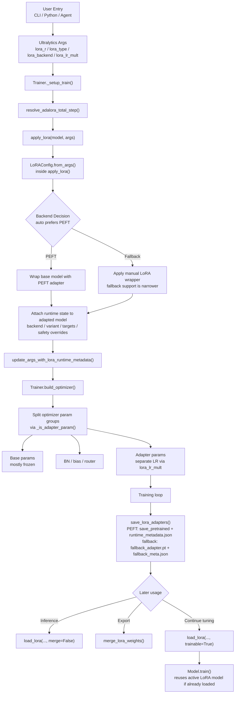

# Ultralytics LoRA Module

This directory contains the LoRA implementation used by YOLO-Master for parameter-efficient fine-tuning of Ultralytics models. It is the package-form replacement for the earlier single-file `ultralytics/utils/lora.py`.

## What This Module Does

The module adds a unified LoRA layer over multiple Ultralytics model families, including:

- Detection
- Segmentation
- Pose
- Classification
- OBB
- RT-DETR
- YOLO-World

It supports two execution paths:

- `PEFT` backend for mainstream adapter variants and adapter serialization
- in-repo `fallback` backend for manual LoRA wrapping when PEFT is unavailable or intentionally bypassed

It also integrates directly with the training stack so adapter injection, optimizer grouping, save/load, merge, and runtime metadata are handled in one flow.

## Package Layout

- [`__init__.py`](/Users/gatilin/PycharmProjects/YOLO-Master-v260510-paper/ultralytics/utils/lora/__init__.py): public entrypoint and backward-compatible re-exports
- [`api.py`](/Users/gatilin/PycharmProjects/YOLO-Master-v260510-paper/ultralytics/utils/lora/api.py): main orchestration for config resolution, backend selection, target detection, and `apply_lora()`
- [`config.py`](/Users/gatilin/PycharmProjects/YOLO-Master-v260510-paper/ultralytics/utils/lora/config.py): `LoRAConfig` and config normalization from trainer args
- [`fallback.py`](/Users/gatilin/PycharmProjects/YOLO-Master-v260510-paper/ultralytics/utils/lora/fallback.py): manual fallback adapters, wrappers, and target filtering helpers
- [`io.py`](/Users/gatilin/PycharmProjects/YOLO-Master-v260510-paper/ultralytics/utils/lora/io.py): save, load, reload-as-trainable, and merge logic
- [`training.py`](/Users/gatilin/PycharmProjects/YOLO-Master-v260510-paper/ultralytics/utils/lora/training.py): training strategies and parameter statistics

## Training Flow

The LoRA path is wired into the standard Ultralytics training loop:

1. `Trainer._setup_train()` calls `apply_lora()` before optimizer construction.
2. The model is wrapped and tagged with runtime LoRA metadata.
3. `Trainer.build_optimizer()` separates adapter parameters into a dedicated param group through `get_lora_param_groups()`.
4. Adapter checkpoints can be saved separately during training with `save_lora_adapters()`.
5. Adapters can later be reloaded for inference, merged export, or continued fine-tuning.

This ordering matters. For example, `lora_lr_mult` only takes effect if LoRA has already been applied before optimizer setup.

## How PEFT Works Inside the Ultralytics Framework

The important part is not only that this repository supports PEFT, but how PEFT is bridged into the existing Ultralytics model and trainer lifecycle.



### 1. Config values are read from normal Ultralytics args

`LoRAConfig.from_args()` maps standard trainer arguments such as:

- `lora_r`
- `lora_alpha`
- `lora_type`
- `lora_backend`
- `lora_target_modules`
- `lora_lr_mult`
- `lora_total_step`

This means PEFT-related settings participate in the same config path as other Ultralytics training arguments instead of requiring a separate launcher or wrapper script.

### 2. PEFT wrapping happens before optimizer creation

Inside [`ultralytics/engine/trainer.py`](/Users/gatilin/PycharmProjects/YOLO-Master-v260510-paper/ultralytics/engine/trainer.py), `Trainer._setup_train()` resolves LoRA-specific runtime values and then calls:

```python
self.model = apply_lora(self.model, self.args)
update_args_with_lora_runtime_metadata(self.args, self.model)
```

This is the main bridge from the Ultralytics training framework into the LoRA package. If the selected backend is PEFT, `apply_lora()` creates the PEFT wrapper, attaches runtime attributes such as backend and variant, and returns a LoRA-enabled model object that the rest of the trainer uses normally.

### 3. Adapter params become a dedicated optimizer param group

After PEFT wrapping, `Trainer.build_optimizer()` scans named parameters and separates adapter parameters using `_is_adapter_param(...)`. Adapter weights are placed in their own optimizer group with:

- independent learning rate via `lora_lr_mult`
- zero weight decay by default

This is how PEFT adapters can be trained differently from the frozen or partially frozen base model while still using the standard Ultralytics optimizer construction path.

### 4. Runtime metadata is fed back into trainer state

After adapter application, runtime metadata is copied back onto trainer args and persisted into `args.yaml`. This is how the framework remembers:

- requested backend
- effective backend
- effective variant
- target modules
- backend-specific runtime decisions

This metadata loop is especially important for AdaLoRA, fallback adapters, and safety-driven overrides such as RT-DETR protections.

### 5. High-level `YOLO` API remains the user-facing surface

The low-level PEFT wrapper is not exposed directly to most users. Instead, [`ultralytics/engine/model.py`](/Users/gatilin/PycharmProjects/YOLO-Master-v260510-paper/ultralytics/engine/model.py) provides framework-native methods:

- `save_lora_only()`
- `load_lora()`
- `merge_lora()`

This keeps the PEFT lifecycle aligned with the usual Ultralytics `YOLO(...)` object model.

### 6. Reloaded PEFT adapters can continue training

`load_lora(..., trainable=True)` forwards into `PeftModel.from_pretrained(..., is_trainable=True)`, so a previously saved adapter can be mounted back onto a base model and immediately reused in `model.train(...)`.

This is one of the key integration points: PEFT is not treated as a one-shot export format, but as a first-class training-time extension inside Ultralytics.

### 7. CLI and agent tooling reuse the same path

The repository's CLI/agent layer does not implement a separate adapter system. It forwards to the same `YOLO.save_lora_only()`, `YOLO.load_lora()`, and `YOLO.merge_lora()` methods, so the PEFT path stays consistent across:

- direct Python usage
- `yolo train ...`
- repository agent/CLI tooling

## Supported Adapter Variants

The PEFT path is designed around the repository's current adapter support:

- LoRA
- DoRA
- LoHa
- LoKr
- AdaLoRA
- IA3
- OFT
- BOFT
- HRA

Notes:

- DoRA is represented as `lora_type=lora` plus `lora_use_dora=True`.
- Rankless PEFT variants such as `IA3`, `OFT`, `BOFT`, and `HRA` do not rely on `lora_r > 0` in the same way as standard LoRA.
- The fallback backend is intentionally narrower than the PEFT path.

## Backend Selection

Backend selection is resolved by `select_lora_backend()`:

- `lora_backend=auto`: prefer PEFT if the request is supported
- `lora_backend=peft`: require PEFT support, otherwise fail explicitly
- `lora_backend=fallback`: require fallback support, otherwise fail explicitly

The repository does not silently downgrade an unsupported `auto` request to fallback. This is deliberate, because silent backend switching can hide behavior differences between PEFT and manual wrapping.

## Save, Load, and Merge

The main runtime helpers are:

- `save_lora_adapters(model, path)`
- `load_lora_adapters(model, path, merge=False, force_replace=False, trainable=False)`
- `merge_lora_weights(model)`

Important behavior:

- PEFT adapters are saved with `save_pretrained()` plus repository-specific `runtime_metadata.json`
- fallback adapters use `fallback_adapter.pt` plus `fallback_meta.json`
- `trainable=True` in `load_lora_adapters()` keeps PEFT adapter parameters trainable, which enables continued fine-tuning after reload
- merge unloads the adapter path back into the base model for export or faster inference

At the high-level model API, these surface as:

- `YOLO.save_lora_only(...)`
- `YOLO.load_lora(..., merge=False, trainable=False)`
- `YOLO.merge_lora()`

## Runtime Safety and Model-Specific Guards

This module contains several guardrails that are easy to miss if you only look at the CLI:

- RT-DETR receives extra safety overrides in `_apply_rtdetr_lora_safety()`
- detection heads may be selectively unfrozen when class-mismatch reinitialization would otherwise leave training ineffective
- PEFT init modes are normalized for compatibility
- target module selection is filtered to avoid unsupported or unstable layers
- adapter runtime state is preserved so later save/load/merge operations know which backend and variant were actually used

## Relationship to the Old `lora.py`

The old monolithic `ultralytics/utils/lora.py` was removed and replaced by this package. The public import surface is preserved through [`__init__.py`](/Users/gatilin/PycharmProjects/YOLO-Master-v260510-paper/ultralytics/utils/lora/__init__.py), so callers can still import from `ultralytics.utils.lora`.

The split was structural, not a feature deletion:

- old single-file implementation: removed
- LoRA functionality: preserved and redistributed into package modules
- public APIs: re-exported from `__init__.py`

## Minimal Usage

CLI training example:

```bash
yolo train cfg=examples/lora_examples/yolo11_lora.yaml
```

Python usage example:

```python
from ultralytics import YOLO

model = YOLO("yolo11n.pt")
model.train(
    data="coco128.yaml",
    epochs=10,
    lora_r=16,
    lora_alpha=32,
    lora_type="lora",
    lora_backend="peft",
)
```

Reload an adapter for continued fine-tuning:

```python
from ultralytics import YOLO

model = YOLO("yolo11n.pt")
model.load_lora("runs/detect/train/weights/lora_adapter", trainable=True)
model.train(data="coco128.yaml", epochs=5)
```

## Validation and Debugging

Useful repository-local checks:

- `python3 scripts/verify_lora_package_split.py`
- `python3 tests/lora_e2e_smoke.py`
- `python3 tests/lora_rankless_smoke.py`

For practical training configs, see:

- [`examples/lora_examples/README.md`](/Users/gatilin/PycharmProjects/YOLO-Master-v260510-paper/examples/lora_examples/README.md)
