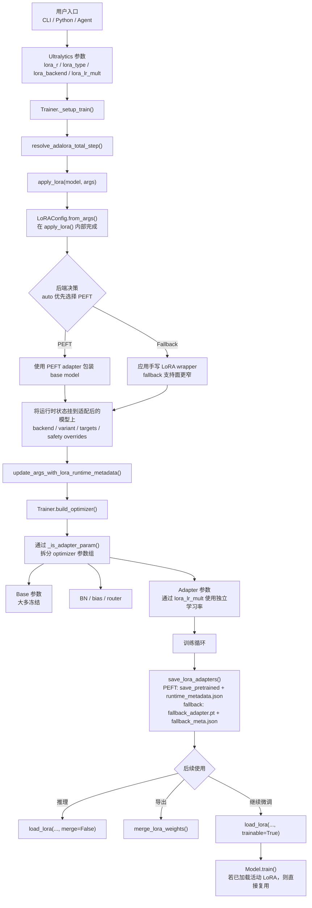

# Ultralytics LoRA 模块说明

这个目录是 YOLO-Master 中 LoRA 模块的核心实现，用于在 Ultralytics 模型上做参数高效微调。它已经取代了早期的单文件实现 `ultralytics/utils/lora.py`。

## 模块职责

这个模块统一承接了多类 Ultralytics 模型的 LoRA 注入与运行时管理，包括：

- 检测
- 分割
- 姿态估计
- 分类
- OBB
- RT-DETR
- YOLO-World

它提供两条执行路径：

- `PEFT` 后端：优先路径，负责主流 PEFT 变体的注入、保存、加载与继续训练
- 仓库内 `fallback` 后端：在 PEFT 不可用或显式要求时，走手写 LoRA 包装路径

同时它已经与训练器深度集成，所以 LoRA 注入、优化器参数分组、adapter 保存/加载/合并、运行时元数据维护都在一条链路里完成。

## 目录结构

- [`__init__.py`](/Users/gatilin/PycharmProjects/YOLO-Master-v260510-paper/ultralytics/utils/lora/__init__.py)：公共入口，负责兼容旧导入路径
- [`api.py`](/Users/gatilin/PycharmProjects/YOLO-Master-v260510-paper/ultralytics/utils/lora/api.py)：LoRA 主流程，包含配置解析、后端选择、目标层识别、`apply_lora()`
- [`config.py`](/Users/gatilin/PycharmProjects/YOLO-Master-v260510-paper/ultralytics/utils/lora/config.py)：`LoRAConfig` 与训练参数映射
- [`fallback.py`](/Users/gatilin/PycharmProjects/YOLO-Master-v260510-paper/ultralytics/utils/lora/fallback.py)：手写 fallback adapter、包装类、目标过滤逻辑
- [`io.py`](/Users/gatilin/PycharmProjects/YOLO-Master-v260510-paper/ultralytics/utils/lora/io.py)：adapter 保存、加载、可训练重载、权重合并
- [`training.py`](/Users/gatilin/PycharmProjects/YOLO-Master-v260510-paper/ultralytics/utils/lora/training.py)：训练策略、参数统计、LoRA 训练期辅助逻辑

## 训练链路

LoRA 训练并不是孤立的工具函数调用，而是已经接入标准训练流程：

1. `Trainer._setup_train()` 在构建优化器之前调用 `apply_lora()`
2. 模型被包装并写入 LoRA 运行时元数据
3. `Trainer.build_optimizer()` 通过 `get_lora_param_groups()` 将 adapter 参数拆到独立 param group
4. 训练期间可以使用 `save_lora_adapters()` 仅保存 adapter
5. 之后可以按需加载 adapter 做推理、合并导出，或继续微调

这里的顺序非常关键。例如 `lora_lr_mult` 是否生效，依赖于 LoRA 是否已经在优化器构建前完成注入。

## PEFT 是如何接入 Ultralytics 框架的

真正重要的不只是“支持 PEFT”，而是“PEFT 如何融入 Ultralytics 原有训练生命周期”。这一层建议结合训练器和 `YOLO` 高层接口一起理解。



### 1. PEFT 配置先走 Ultralytics 标准参数通道

`LoRAConfig.from_args()` 会从普通训练参数里读取并映射例如：

- `lora_r`
- `lora_alpha`
- `lora_type`
- `lora_backend`
- `lora_target_modules`
- `lora_lr_mult`
- `lora_total_step`

也就是说，PEFT 不是旁路系统，而是和普通 Ultralytics 参数一起进入训练器配置流。

### 2. 在优化器构建前完成 PEFT 包装

在 [`ultralytics/engine/trainer.py`](/Users/gatilin/PycharmProjects/YOLO-Master-v260510-paper/ultralytics/engine/trainer.py) 中，`Trainer._setup_train()` 会先解析 LoRA 运行时参数，然后执行：

```python
self.model = apply_lora(self.model, self.args)
update_args_with_lora_runtime_metadata(self.args, self.model)
```

这里就是 Ultralytics 训练框架接入 LoRA/PEFT 的核心桥接点。如果最终选择的是 PEFT 后端，那么 `apply_lora()` 会创建 PEFT 包装对象，给模型打上 backend、variant 等运行时标记，然后把这个 LoRA 化之后的模型继续交回训练器使用。

### 3. Adapter 参数在优化器中单独分组

PEFT 包装完成后，`Trainer.build_optimizer()` 会遍历参数名，并通过 `_is_adapter_param(...)` 识别 adapter 参数。识别出来的参数会被拆进独立的 optimizer param group，并具备：

- 由 `lora_lr_mult` 控制的单独学习率
- 默认 `weight_decay=0.0`

这样一来，PEFT adapter 可以和 base model 采用不同训练策略，但整体仍然复用 Ultralytics 原生的优化器构建流程。

### 4. 运行时元数据会回写到训练器状态

LoRA/PEFT 注入完成后，运行时元数据会被同步回 `args`，并持久化进 `args.yaml`。这让框架能够记住：

- 请求的 backend
- 实际生效的 backend
- 实际使用的 variant
- target modules
- 运行时自动修正后的关键决策

这对 AdaLoRA、fallback 路径，以及 RT-DETR 这类带安全保护逻辑的场景尤其关键。

### 5. 用户主要通过高层 `YOLO` API 操作 PEFT

多数情况下，用户不需要直接操作底层 PEFT wrapper。仓库在 [`ultralytics/engine/model.py`](/Users/gatilin/PycharmProjects/YOLO-Master-v260510-paper/ultralytics/engine/model.py) 中提供了更符合 Ultralytics 风格的高层接口：

- `save_lora_only()`
- `load_lora()`
- `merge_lora()`

这样 PEFT 的保存、加载、合并都被纳入标准 `YOLO(...)` 对象工作流。

### 6. 重载后的 PEFT adapter 可以继续训练

`load_lora(..., trainable=True)` 最终会走到 `PeftModel.from_pretrained(..., is_trainable=True)`。这意味着一个之前保存过的 adapter 可以重新挂回 base model，并马上继续执行 `model.train(...)`。

这是当前集成里非常关键的一点：PEFT 在这里不是一次性导出物，而是 Ultralytics 训练期的一等扩展能力。

### 7. CLI 和 agent 工具层复用的是同一条路径

仓库里的 CLI/agent 并没有另外实现一套 adapter 系统，而是继续转发到同一组高层接口，也就是 `YOLO.save_lora_only()`、`YOLO.load_lora()`、`YOLO.merge_lora()`。因此以下几种入口最终走的是同一条主链路：

- 直接 Python 调用
- `yolo train ...`
- 仓库内 agent / CLI 工具

## 当前支持的 Adapter 变体

PEFT 路径当前围绕以下变体设计：

- LoRA
- DoRA
- LoHa
- LoKr
- AdaLoRA
- IA3
- OFT
- BOFT
- HRA

补充说明：

- DoRA 在实现上是 `lora_type=lora` 配合 `lora_use_dora=True`
- `IA3`、`OFT`、`BOFT`、`HRA` 这类 rankless 变体，不完全依赖传统意义上的 `lora_r > 0`
- fallback 后端支持面会比 PEFT 更窄，这属于有意限制

## 后端选择策略

后端由 `select_lora_backend()` 决定：

- `lora_backend=auto`：优先使用 PEFT
- `lora_backend=peft`：必须满足 PEFT 支持，否则显式报错
- `lora_backend=fallback`：必须满足 fallback 支持，否则显式报错

这里有一个重要设计：`auto` 不会静默降级到 fallback。原因是不同后端在行为、保存格式、目标层支持上有差异，静默切换会掩盖真实运行路径。

## 保存、加载与合并

主要接口包括：

- `save_lora_adapters(model, path)`
- `load_lora_adapters(model, path, merge=False, force_replace=False, trainable=False)`
- `merge_lora_weights(model)`

关键行为：

- PEFT adapter 通过 `save_pretrained()` 保存，同时额外写入 `runtime_metadata.json`
- fallback adapter 使用 `fallback_adapter.pt` 与 `fallback_meta.json`
- `load_lora_adapters(..., trainable=True)` 会让 PEFT adapter 以可训练状态重新挂载，适合继续微调
- merge 会把 adapter 融回 base model，便于导出或加快推理

在高层 `YOLO` 接口上，对应为：

- `YOLO.save_lora_only(...)`
- `YOLO.load_lora(..., merge=False, trainable=False)`
- `YOLO.merge_lora()`

## 运行时保护与模型特化逻辑

这个模块里还有不少“只看 CLI 不容易发现”的保护逻辑：

- RT-DETR 会在 `_apply_rtdetr_lora_safety()` 里施加额外安全限制
- 某些类别不匹配场景下，检测头会被有选择地解冻，避免训练无效
- PEFT 初始化方式会做兼容性归一化
- 目标层会经过过滤，规避不支持或高风险模块
- 运行时元数据会被保留下来，后续保存、加载、合并时能知道真实使用的是哪个后端和变体

## 与旧版 `lora.py` 的关系

旧的单文件 `ultralytics/utils/lora.py` 已经删除，替换成当前这个目录包。但对外导入面没有丢，仍然可以通过 [`__init__.py`](/Users/gatilin/PycharmProjects/YOLO-Master-v260510-paper/ultralytics/utils/lora/__init__.py) 继续使用 `ultralytics.utils.lora` 入口。

这次变更的本质是“结构拆分”，不是“功能删除”：

- 旧载体：单文件 `lora.py` 已移除
- 核心能力：迁移并拆分到多个模块中
- 公共 API：通过 `__init__.py` 继续统一导出

## 最小使用示例

CLI 训练：

```bash
yolo train cfg=examples/lora_examples/yolo11_lora.yaml
```

Python 训练：

```python
from ultralytics import YOLO

model = YOLO("yolo11n.pt")
model.train(
    data="coco128.yaml",
    epochs=10,
    lora_r=16,
    lora_alpha=32,
    lora_type="lora",
    lora_backend="peft",
)
```

重载 adapter 并继续微调：

```python
from ultralytics import YOLO

model = YOLO("yolo11n.pt")
model.load_lora("runs/detect/train/weights/lora_adapter", trainable=True)
model.train(data="coco128.yaml", epochs=5)
```

## 校验与调试建议

仓库内比较实用的校验入口有：

- `python3 scripts/verify_lora_package_split.py`
- `python3 tests/lora_e2e_smoke.py`
- `python3 tests/lora_rankless_smoke.py`

如果想看实际训练配置示例，可以继续参考：

- [`examples/lora_examples/README.md`](/Users/gatilin/PycharmProjects/YOLO-Master-v260510-paper/examples/lora_examples/README.md)
